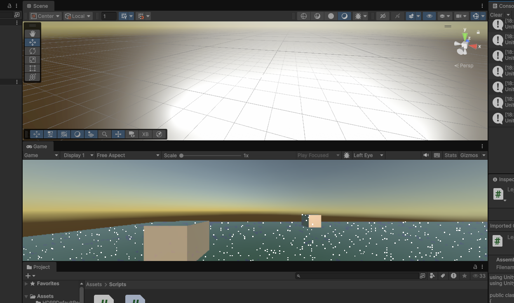
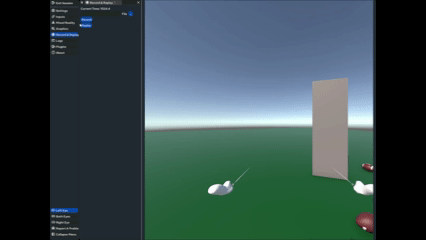

# PR6-II-KyliamChinea
Esta práctica nos introdujo con la utilización de la herramienta XR Interaction Toolkit. En la sesión introductoria, no tuve más problemas que el de que los controles no estaban configurados como se esperaba. Después de realizar un par de pruebas, encontramos que el botón para seleccionar un objeto en el simulador estaba dispuesto en la tecla U. No me dio tiempo a grabar ni a finalizar los scripts o a registrar cómo funcionaban. También, debido a la alerta meteorológica, no pude continuar el proyecto en el centro de calculo y tuve que comenzarlo desde cero en mi computadora.
Luego de numerosos problemas y obstáculos, logré que el simulador funcionara, sin embargo, en un momento dejó de abrirse. Añado una captura de pantalla de la pestaña "Game" y los scripts que, según estudie, deberían ser funcionales:


Script parea el cubo cercano:

```csharp
using UnityEngine;
using UnityEngine.XR.Interaction.Toolkit;

public class Cercano : MonoBehaviour
{
    public void OnSelect(SelectEnterEventArgs args)
    {
        Debug.Log("Se ha cogido el cubo");
    }
    void Start()
    {
        var interactable = GetComponent<UnityEngine.XR.Interaction.Toolkit.Interactables.XRGrabInteractable>();
        interactable.selectEntered.AddListener(OnSelect);
    }
}
```

Script parea el cubo lejano:

```csharp
using UnityEngine;
using UnityEngine.XR.Interaction.Toolkit;

public class Lejano : MonoBehaviour
{
    private MeshRenderer rend;
    private Color originalColor;

    public void OnHoverEnter(SelectEnterEventArgs args)
    {
        rend.material.color = Color.red;
    }

    public void OnHoverExit(SelectExitEventArgs args)
    {
        rend.material.color = originalColor;
    }
    void Start()
    {
        rend = gameObject.GetComponent<MeshRenderer>();
        originalColor = rend.material.color;
        var interactable = GetComponent<UnityEngine.XR.Interaction.Toolkit.Interactables.XRBaseInteractable>();
        interactable.hoverEntered.AddListener(OnHoverEnter);
        interactable.hoverExited.AddListener(OnHoverExit);
    }
}
```

No obstante en la sesión espero pder entrar al proyecto que tenia en el ordenador de el centro de calculo y añadir los scripts y comprobar que funcionan.




## Enlaces de interes

[Documentacion XR Interaction Toolkit](https://docs.unity3d.com/Packages/com.unity.xr.interaction.toolkit@3.1/api/UnityEngine.XR.Interaction.Toolkit.HoverEnterEventArgs.html)
